---

## 🧠 About Me
- 💻 Backend engineer (Python, C++, TypeScript)
- ⚙️ Building with **Node.js** and low-level systems
- 📊 Strong in **NumPy / Pandas** for data-heavy workflows
- 🔐 Cybersecurity enthusiast (practical, not theoretical)
- 📈 Currently transitioning into **Quant Development**
- 🧩 Interested in systems where **software meets hardware & networks**

---

## ⚡ What I Do
- Design and build **scalable backend systems**
- Work on **secure architectures** (hybrid encryption, transport security)
- Explore **network-level tooling & anonymity systems**
- Optimize systems with a focus on **performance and efficiency**
- Build tools that are **useful, not just impressive**

---

## 🛠️ Tech Stack

### Languages
Python • C++ • TypeScript • Bash

### Frameworks & Tools
Node.js • Express • Linux • Git • Docker

### Data & Analysis
NumPy • Pandas • Data Modeling • Statistical Thinking

### Security & Networking
Encryption (AES, RSA, Hybrid) • Proxychains • Tor • System-level networking

---

## 🧪 Current Focus

- 📉 Financial systems & **quantitative modeling**
- ⚡ Low-latency and high-performance systems
- 🔐 Secure communication pipelines
- 🧠 Bridging **math + code + markets**

---

## 🚧 Projects
- 🧰 Various internal tools
  Built for performance, automation, and learning deep systems

---

## 🧠 Philosophy
- Keep things **simple, efficient, and correct**
- Avoid hype — focus on **real capability**
- Learn by **building and breaking systems**
- Prefer **depth over surface-level knowledge**

---

## 📫 Connect
- 📧 Email: [isaiahnyariki300@gmail.com](mailto:isaiahnyariki300@gmail.com)
- 📞 Phone: +254 711 929 567
- 🌐 Portfolio: [nyariki-isaiah.vercel.app](https://nyariki-isaiah.vercel.app)
- 💼 LinkedIn: [Isaiah Nyariki](https://www.linkedin.com/in/isaiah-nyariki-593392365)
- 🐙 GitHub: [github.com/your-username](https://github.com/your-username)

---

## ⚙️ Fun Facts
- I care more about *how things work* than *what they do*
- I'd rather debug a system than use a black box
- I see software as a **tool for leverage**, not just creation
